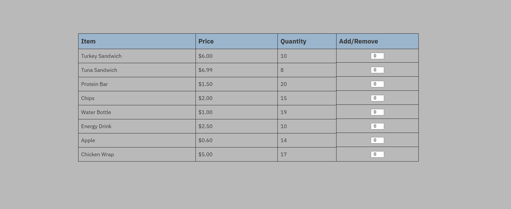

# Inventory Manager

This project allows users to keep track of stock for items listed in the inventory. It uses a simple and intuitive user interface that allows users to modify quantity values using either positive or negative numbers.

- Positive values indicate a restock
- Negative values indicate a sale

## Current Features
- Low stock indicator
- Tabular front-end interface
- Dynamic quantity manipulation using JavaScript
- Inventory tracking system
- SQL database with transaction logging

## Planned Features
- Ability to create and delete inventory items
- Fully connected backend with automatic database updates
- Transaction history tab within the frontend
- Persistent inventory data using backend/database integration

## Technologies Used
- HTML
- CSS
- JavaScript
- MySQL

## Screenshot

